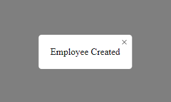

# Modal Component by BenjGit

This is a modal component for react.

## Getting Started

Install this package:

```shell
npm add ben-modal-component
```

Import the Modal component:

```js
import { Modal } from "ben-modal-component";
```
You can then render the `Modal` as follow:

```js
<Modal
        isOpen={showSuccessModal}
        onClose={handleCloseSuccessModal}
>
    Employee Created // you can put div span or whatever you want inside it
</Modal>
```
The modal will look like this :



By default the modal take the width and height depending of the content inside it (width:auto and height:auto by default).
But you can change style if you want :

The following default styles applied to the modal component can be changed :

width, height, borderRadius, backgroundColor, padding

```js
<Modal
        isOpen={showSuccessModal}
        onClose={handleCloseSuccessModal}
        width='200px'
        height='200px'
        borderRadius='5px'
        backgroundColor='#000'
        padding='20px'
>
    Employee Created 
</Modal>
```

